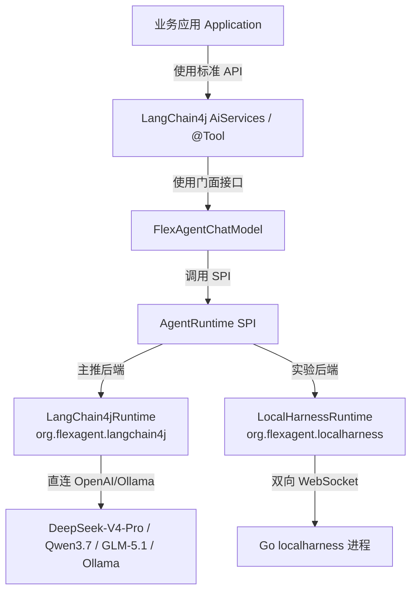

# FlexAgent Java Adapter

> ⚠️ **免责声明 (Disclaimer)**
> **FlexAgent** is a Java-native, pluggable agent runtime framework for LangChain4j and OpenAI-compatible models. It is inspired by modern agent runtime architectures, but it is not affiliated with, endorsed by, or connected to Google, Gemini, or Antigravity.
> 本项目是社区驱动的第三方适配层，**并非 Google 官方项目，与 Google、Gemini、Antigravity 没有任何官方或法律关联**。
> `flexagent-localharness` 是可选的本地运行时适配模块，**本项目不内置、不修改、不分发任何专有或受版权保护的 local harness 二进制文件**。

**FlexAgent Java Adapter** 是一个面向 Java / LangChain4j 生态的 Agent Runtime 适配层。它允许 Java 开发者在**同一套 `@Tool` 业务代码下**，无缝地在本地 Ollama、远程大模型 API (DeepSeek-R1, Qwen3.7, GLM-5.1) 以及 Google LocalHarness 等后端之间自由切换。

---

## 🌟 为什么选择本适配层？

在进行大模型智能体开发时，通常会遇到**工具深度绑定**和**推理标签提取困难**等工程化壁垒。本项目在设计之初就以“开源易用”为目标，具备以下技术优势：

* **工具彻底解耦 (Core Innovation)**：
  原本的适配器大多强依赖特定引擎的 Protobuf 类。本项目重新设计了消息隔离层：
  ```
  @Tool Method (业务)  -->  ToolAdapter  -->  ToolDefinition (核心通用抽象)  -->  具体的 Runtime 适配
  ```
  实现了纯净的依赖解耦，即使未来引入 Spring AI 生态，工具方法也无需重写。
* **推理思考流分段支持**：内置高效的 `<think>` 推理流状态机，即时在流式传输中发生“字符切碎”或“标签未闭合”等坏情况，也能精准将其剥离为推理事件与文本事件。
* **工程化容错控制 (ToolCallPolicy)**：内置 `STRICT`、`LENIENT`、`TEXT_FALLBACK` 策略，轻松应对大模型产生的 JSON 幻觉和破碎参数输出。
* **极简上下文压缩**：内置滑动窗口压缩（`SlidingWindowCompactionStrategy`），支持自动保留关键 `SystemMessage` 的同时滑动裁剪老消息，有效防范 Token 膨胀。

---

## 🚀 5 分钟快速上手 (直连 DeepSeek-R1)

你**完全不需要**安装任何 Google FlexAgent CLI 或 localharness 引擎，即可在本地独立运行我们的 Demo！

### 1. 引入依赖
在你的 `pom.xml` 中引入本适配层（主推 native `flexagent-langchain4j`）：
```xml
<dependency>
    <groupId>org.flexagent</groupId>
    <artifactId>flexagent-langchain4j</artifactId>
    <version>0.1.0-SNAPSHOT</version>
</dependency>
```

### 2. 定义业务工具
```java
import dev.langchain4j.agent.tool.P;
import dev.langchain4j.agent.tool.Tool;

public class WeatherTools {
    @Tool("获取指定城市的当前天气情况")
    public String getWeather(@P("city") String city) {
        return city + "的天气为 晴转多云，22℃。";
    }
}
```

### 3. 初始化并驱动 Agent Loop
```java
import org.flexagent.core.runtime.*;
import org.flexagent.langchain4j.*;
import dev.langchain4j.model.openai.OpenAiChatModel;

public class Main {
    public static void main(String[] args) throws Exception {
        // 1. 初始化你的 LangChain4j 底层大模型 (如直连国内 DeepSeek API)
        ChatLanguageModel deepSeekModel = OpenAiChatModel.builder()
                .baseUrl("https://api.deepseek.com/v1")
                .apiKey(System.getenv("DEEPSEEK_API_KEY"))
                .modelName("deepseek-reasoner") // 使用带有思考的 R1 模型
                .build();

        // 2. 使用适配器组装 Agent 并注册工具
        FlexAgentChatModel model = FlexAgentChatModel.builder()
                .delegateModel(deepSeekModel)
                .toolCallPolicy(ToolCallPolicy.TEXT_FALLBACK) // 容错回退机制
                .addToolObject(new WeatherTools())
                .build();

        // 3. 开始对话
        String response = model.generate("北京天气怎么样？获取完后请写出一首有关此时北京的诗。");
        System.out.println(response);
    }
}
```

---

## 🛠️ 项目架构



* **`flexagent-core`**：核心抽象。包含 `AgentRuntime` SPI、通用 `ToolDefinition` 与 R1 推理流提取状态机。
* **`flexagent-langchain4j` (推荐)**：生态适配。完全由 Java 驱动的 Agent 多轮决策控制环，内建窗口压缩与容错回退。
* **`flexagent-localharness` (实验特性)**：用于兼容官方引擎。

---

## 📝 开源计划 (Roadmap)

- [x] Java 21 虚拟线程 (Virtual Threads) 对等消息轮询
- [x] 模块间彻底解耦并提供统一的 `@Tool` 抽象
- [x] 坏情况流式 R1 `<think>` 标签过滤及回溯状态机
- [x] 内置 Tool 容错容灾回退策略 (TEXT_FALLBACK)
- [ ] 支持对接 **Spring AI** 生态适配模块 (`flexagent-spring-ai`)
- [ ] 增加 MCP (Model Context Protocol) 运行时支持
