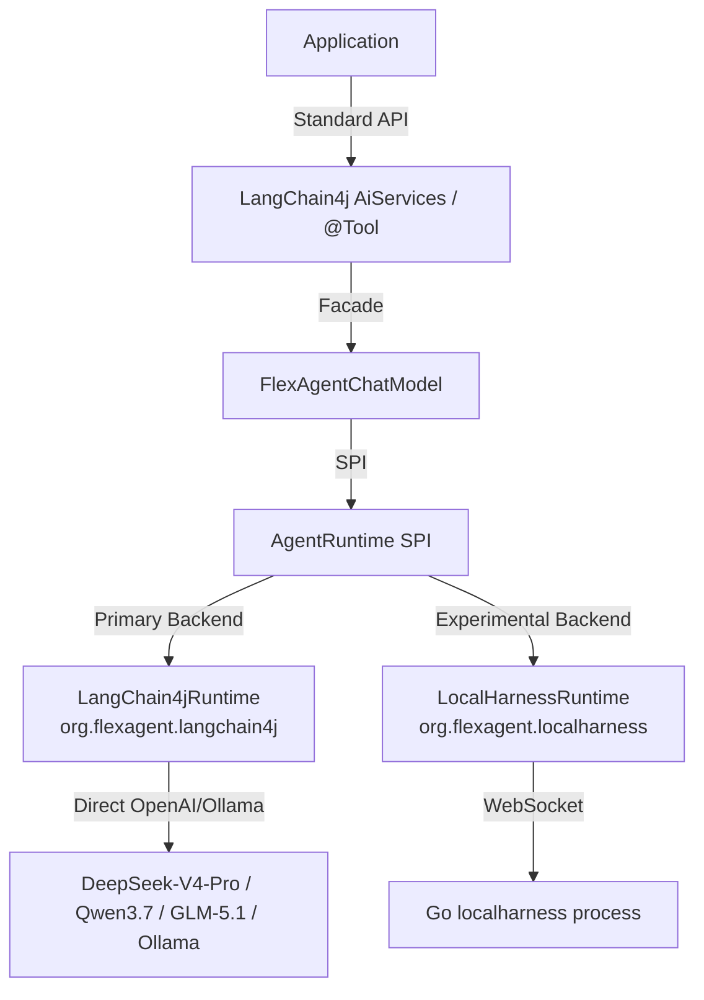

# FlexAgent Java Adapter

> ⚠️ **Disclaimer**: **FlexAgent** is a Java-native, pluggable agent runtime framework for LangChain4j and OpenAI-compatible models. It is inspired by modern agent runtime architectures, but it is not affiliated with, endorsed by, or connected to Google, Gemini, or Antigravity.
> The `flexagent-localharness` module is an optional runtime adapter. **It does not bundle, modify, or redistribute any proprietary or copyrighted local harness binary.**

**FlexAgent Java Adapter** is an Agent Runtime adapter layer designed for the Java and LangChain4j ecosystem. It empowers Java developers to seamlessly switch their Agent backend across local Ollama, remote LLM APIs (DeepSeek-R1, Qwen3.7, GLM-5.1), and Google LocalHarness, **without rewriting a single line of `@Tool` business logic**.

---

## 🌟 Key Features

* **Zero-Coupling Tool Management (Core Innovation)**:
  Decouples tool-calling specifications from engine-specific message schemes. Tools are scanned into a generic middle representation `ToolDefinition` before translating to any specific runtime payload.
  ```
  @Tool Method (Business)  -->  ToolAdapter  -->  ToolDefinition (Core Abstraction)  -->  Specific Runtime
  ```
* **Streaming `<think>` Parser**: A robust XML tag extraction state machine that isolates thoughts from final markdown text stream, even when chunks are fragmented or unclosed.
* **Flexible Tolerant Policy (ToolCallPolicy)**: Offers `STRICT`, `LENIENT`, and `TEXT_FALLBACK` policies to gracefully handle hallucinated or malformed JSON payloads generated by LLMs.
* **Context Compaction**: Simple sliding window truncation (`SlidingWindowCompactionStrategy`) that limits message history while preserving critical system prompts.

---

## 🚀 5-Minute Quick Start (Direct DeepSeek-R1)

No Google FlexAgent CLI or localharness binary is required to run this native integration!

### 1. Maven Dependency
Add the LangChain4j adapter submodule to your `pom.xml`:
```xml
<dependency>
    <groupId>org.flexagent</groupId>
    <artifactId>flexagent-langchain4j</artifactId>
    <version>0.1.0-SNAPSHOT</version>
</dependency>
```

### 2. Define Your Custom Tool
```java
import dev.langchain4j.agent.tool.P;
import dev.langchain4j.agent.tool.Tool;

public class WeatherTools {
    @Tool("Get current weather by city name")
    public String getWeather(@P("city") String city) {
        return city + " is sunny, 22°C.";
    }
}
```

### 3. Initialize and Run the Agent Loop
```java
import org.flexagent.core.runtime.*;
import org.flexagent.langchain4j.*;
import dev.langchain4j.model.openai.OpenAiChatModel;

public class Main {
    public static void main(String[] args) throws Exception {
        // 1. Setup LangChain4j LLM client (e.g. DeepSeek API)
        ChatLanguageModel deepSeekModel = OpenAiChatModel.builder()
                .baseUrl("https://api.deepseek.com/v1")
                .apiKey(System.getenv("DEEPSEEK_API_KEY"))
                .modelName("deepseek-reasoner") // R1 reasoning model
                .build();

        // 2. Wrap it with FlexAgentChatModel
        FlexAgentChatModel model = FlexAgentChatModel.builder()
                .delegateModel(deepSeekModel)
                .toolCallPolicy(ToolCallPolicy.TEXT_FALLBACK)
                .addToolObject(new WeatherTools())
                .build();

        // 3. Drive conversation
        String response = model.generate("How is the weather in Beijing?");
        System.out.println(response);
    }
}
```

---

## 🛠️ Architecture


